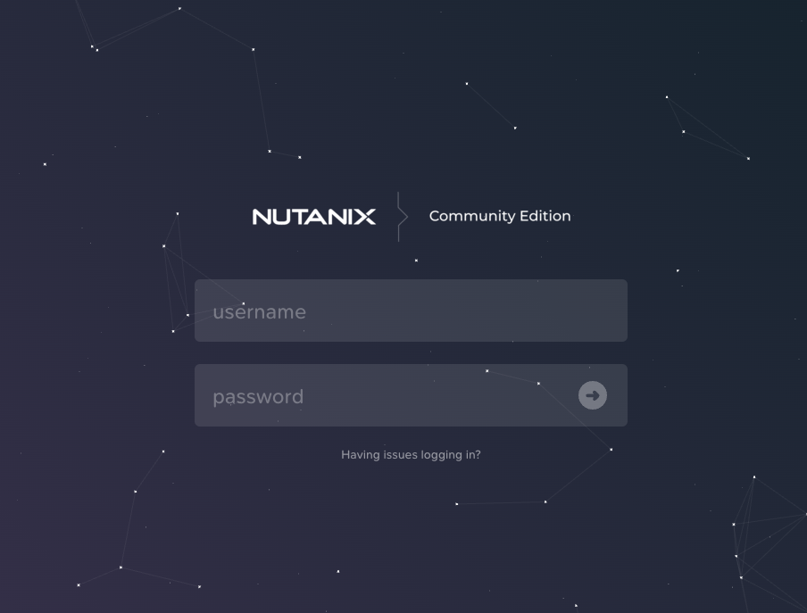
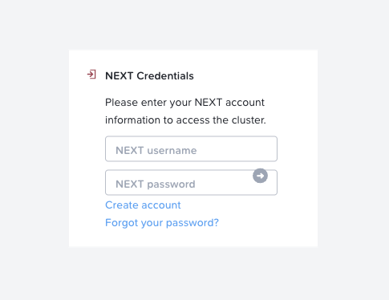
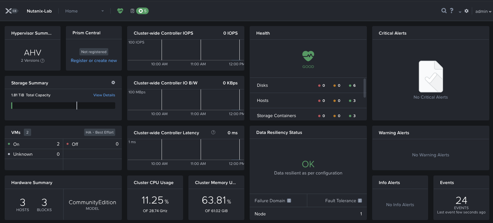

In progress ...

# One node Nutanix installation

## Installation of 3 Storage Devices

Nutanix requires 3 storage devices to function:
 - 1 SSD disk for the CVM (Controller Virtual Machine)
 - 1 HDD/SSD disk for data storage
 - 1 disk for the hypervisor

In my setup, I used an NVMe SSD for the CVM, a SATA SSD for data storage, and an external USB drive for the hypervisor.

 

For the installation, you will also need another USB drive (minimum 16GB) to boot from the Nutanix ISO.

After downloading the Nutanix ISO from [the official website](https://www.nutanix.com/products/community-edition/register), you need to use [Rufus](https://rufus.ie/en/) to create the bootable USB drive. (*Don't waste your time trying other software, I've already done that for you* 😅)

## BIOS configuration

Before starting the Nutanix installation, make sure to enable some important options in your machine's BIOS:
- CPU virtualization
- Automatic restart after power failure
- Wake On LAN
- Allow booting from your installation USB drive

## Choice of hypervisor

One of Nutanix's great strengths is its ability to work with different hypervisors:
- **Nutanix AHV**: A type 1 hypervisor developed by Nutanix, offering features comparable to VMware ESXi Enterprise, such as high availability (HA), live virtual machine migration (vMotion), and resource scheduling (DRS). AHV is natively integrated into the Nutanix solution, simplifying management and reducing licensing costs.
- **VMware ESXi**: A widely recognized type 1 hypervisor deployed in enterprise environments. Nutanix ensures compatibility with ESXi, allowing organizations to continue using their existing VMware environments while benefiting from Nutanix's hyperconverged infrastructure advantages.
- **Microsoft Hyper-V**: A type 1 hypervisor developed by Microsoft. Nutanix added Hyper-V support, offering an alternative for companies using Microsoft technologies. This compatibility enables seamless integration with Windows Server environments and associated services.

In our case, for simplicity, we will use the Nutanix AHV hypervisor.

## Nutanix installation

Soyez patient, l'installation prend quelques minutes à différentes étapes, ne vous inquiétez pas : ca s'installe !

Alors on boot sur la clé USB et l'installation va commencer. Vous arriverez sur une étape importante : l'attribution des disques et la configuration du réseau.


C'est ici qu'il faut prendre le temps de configurer les disques et le réseau et choisir l'hyperviseur.

### Hypervisor

If you downloaded the correct Nutanix ISO, AHV should be pre-selected: leave it as is.

### Disks

For the disks, you need to select the 3 disks you prepared earlier and assign them the letter corresponding to the system that will use them:
 - **[C]** for the CVM (The NVMe SSD in this case)
 - **[D]** for storage (The SATA SSD in this case)
 - **[H]** for the hypervisor (The external USB drive in this case)

 And **[I]** corresponds to your installation device (The USB drive in this case)

### Network

If you have configured the network correctly, you should know the information to enter for the network configuration.

In my case, I will assign the following information:

**Node #1**
- Host IP Address: 192.168.100.10
- CVM IP Address: 192.168.100.11
- Subnet Mask: 255.255.255.0
- Gateway: 192.168.100.1

**Node #2**
- Host IP Address: 192.168.101.20
- CVM IP Address: 192.168.101.21
- Subnet Mask: 255.255.255.0
- Gateway: 192.168.101.1

**Node #3**
- Host IP Address: 192.168.102.30
- CVM IP Address: 192.168.102.31
- Subnet Mask: 255.255.255.0
- Gateway: 192.168.102.1

We will see the cluster IP address during cluster creation.

You can finish the installation until you have a terminal on the system.

# Nutanix configuration

Now that the OS is installed, we will configure the system:

## Connexion

### Nutanix AHV
Identifiant : `root`

Mot de passe par défaut : `nutanix/4u`

### Nutanix CVM 

```bash
ssh nutanix@192.168.100.11
```

Identifiant : `nutanix`

Mot de passe par défaut : `nutanix/4u`

## Base configuration

### Keymap

```bash
localectl set-keymap fr-azerty
```

### Timezone

```bash
timedatectl set-timezone Europe/Paris
```

### Hostname

```bash
hostnamectl set-hostname node-1
```

# Nutanix cluster

Pour créer un cluster, assurez-vous d'avoir l'ensemble de vos nodes installés et configurés.

Puis vous pourrez lancer la création du cluster avec la commande suivante depuis le node principal :

```bash
cluster -s 192.168.100.11,192.168.101.21,192.168.102.31 create
```

If you encounter this error:
```
2025-01-01 08:07:50 CRITICAL cluster:600 Could not discover all nodes specified. Please make sure that the SVMs from which you wish to create the cluster are not already part of another cluster. Undiscovered ips : x.x.x.6,x.x.x.7,x.x.x.8,x.x.x.9
```

Restart the nodes specified in the error and try the command again.
If it still doesn't work, you can directly consult the [dedicated thread for this error](https://portal.nutanix.com/page/documents/kbs/details?targetId=kA032000000TTkvCAG).

This installationprocess will take 15-20 minutes to complete.

Once the cluster is created, you will be able to access it from the web interface `https://192.168.100.11:9440` :



```bash
username = "admin"
password = "nutanix/4u"
```

And change the password of the admin user.

It is then necessary to connect with your NEXT (Nutanix account) account :




Tadaaa 🎉 ! Your cluster is ready to use !

