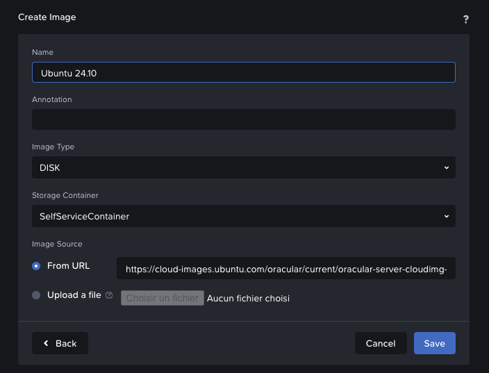

# From web interface

## Upload image

To do this, go to **`Settings`** > **`Image Configuration`** > **`Upload Image`**

You can directly enter the download link of the image or upload your file :

🔥 Tips : for Ubuntu images → https://cloud-images.ubuntu.com/



## Create instance

To do this, go to **`VM`** > **`Create VM`**


I use this cloud-init script to configure the instance :

```bash
#cloud-config

# Create papamica user
users:
  - name: papamica
    sudo: ['ALL=(ALL) NOPASSWD:ALL']
    shell: /bin/bash
    ssh_authorized_keys:
      - <your_ssh_key>

# Set keyboard layout to AZERTY
keyboard:
  layout: fr

# Mount additional disks if they exist
runcmd:
  - |
    for disk in b c d e f; do
      if [ -e "/dev/sd${disk}" ]; then
        parted -s /dev/sd${disk} mklabel gpt
        parted -s /dev/sd${disk} mkpart primary ext4 0% 100%
        mkfs.ext4 -F /dev/sd${disk}1
        mkdir -p /mnt/data${disk}
        echo "/dev/sd${disk}1 /mnt/data${disk} ext4 defaults 0 2" >> /etc/fstab
        mount /mnt/data${disk}
      fi
    done

```

# From CLI

In progress ...

# From Terraform
In progress ...
