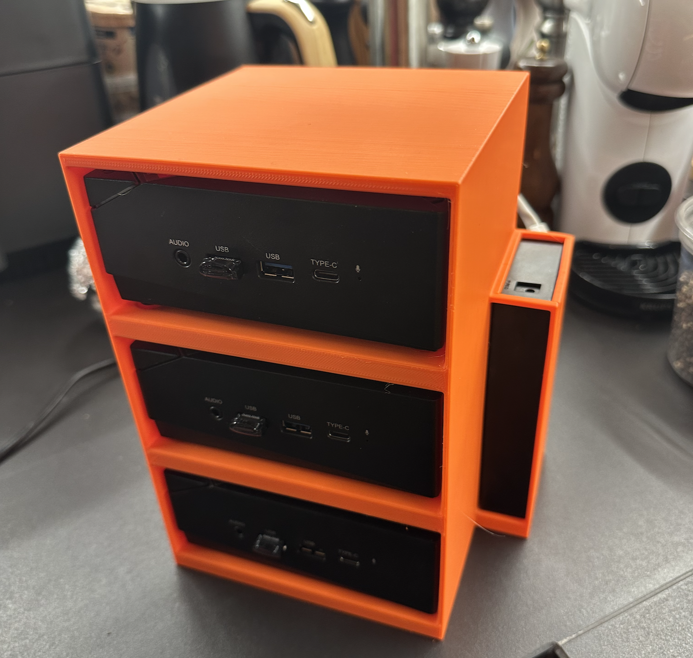
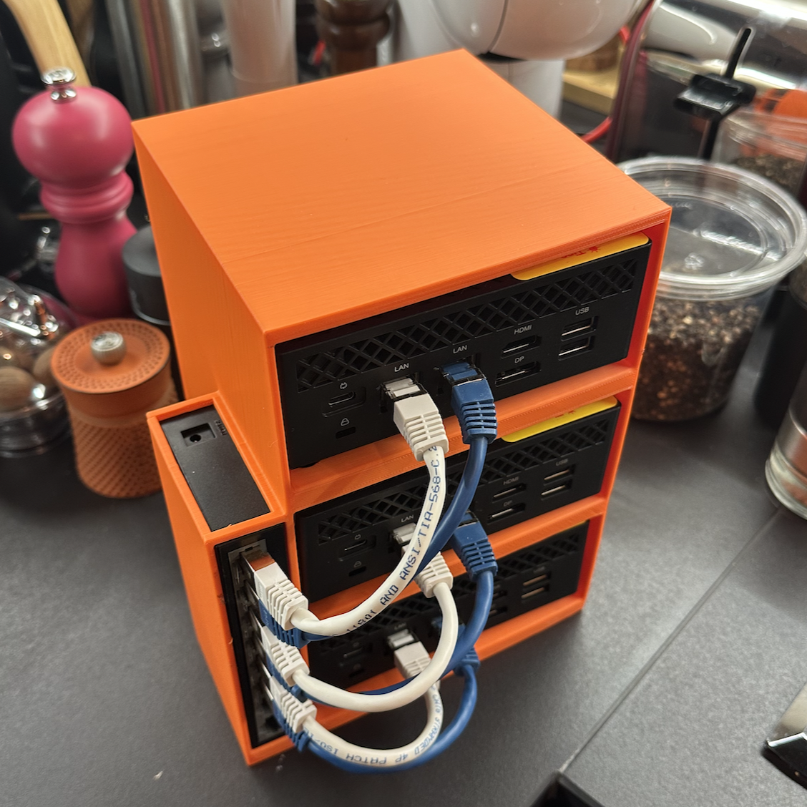

# Choosing the Right Hardware

## Cluster Design and Requirements
For this lab, I opted for a three-node Nutanix cluster to explore advanced features and ensure high availability. Each node integrates compute, storage, and networking, replicating the design of a production-ready hyperconverged environment.

### Minimum Requirements per Node
- **Storage Devices**:
  1. NVMe SSD for the Distributed Storage Fabric (DSF) cache
  2. SATA SSD for data storage
  3. USB drive (64 GB) for the hypervisor installation
- **Hardware Requirements**:
  - 16 GB RAM minimum
  - 4 cores / 8 Threads minimum

## Hardware Selection
After thorough research, I chose the [ACEMAGICIAN AM06PRO Mini PC](https://amzn.to/3W6YD5n) for each node.

### Key Features
- **Processor**: AMD Ryzen 7 5700U (8 cores, 16 threads, up to 4.4 GHz)
- **Memory**: 32 GB DDR4 RAM
- **Storage Options**:
  - NVMe SSD (512 GB, included)
  - Additional SATA SSD support
  - USB-C ports for flexible power options
- **Networking**: Dual Ethernet ports (1 Gbps and 2.5 Gbps)

### Advantages of this Setup
1. **Small Form Factor**: Minimal space requirements
2. **Energy Efficiency**: Low power consumption
3. **Low Noise**: Suitable for home office
4. **Expandability**: Multiple storage options
5. **Future-Proofing**: 2.5 Gbps network support

## Network Equipment
- **Switch**: [TP-Link Gigabit Switch](https://amzn.to/3W2vys4)
- **Current Speed**: 1 Gbps (sufficient for basic lab)
- **Upgrade Path**: 2.5 Gbps switch compatibility for future expansion

## Storage Devices

- **NVMe SSD**: [Samsung SSD 990 Pro](https://amzn.to/4iWHQMp)
- **SATA SSD**: [Samsung SSD 870 EVO](https://amzn.to/4a1GlbL)
- **USB Drive**: [SanDisk Ultra Fit 64 Go ](https://amzn.to/420XiRm)

## Custom Enclosure: Design and 3D Printing

To keep the setup compact and visually appealing, I designed a custom 3-node cluster enclosure using Fusion 360 and printed it with a 3D printer. Here’s the process:

### Modeling in Fusion 360:

The design accommodates three ACEMAGICIAN AM06PRO Mini PCs stacked vertically.
Ventilation holes are included for cooling, ensuring airflow for all nodes.

### Printing the Enclosure:

The model was printed in PLA for durability and ease of use.
Printing time: approximately 35 hours in total, depending on the 3D printer used.

### Assembly:

The PCs fit snugly into the enclosure.
I added labels for easy identification of nodes and ports.
This enclosure not only organizes the hardware but also creates a professional appearance for the lab. It’s a satisfying addition for anyone who enjoys DIY projects alongside IT experimentation.

### Design Specifications
- **Software**: Fusion 360
- **Material**: PLA
- **Print Duration**: ~35 hours

### Features
1. Vertical stacking for three nodes
2. Integrated ventilation system
3. Cable management solutions
4. Node identification system
5. Professional appearance

