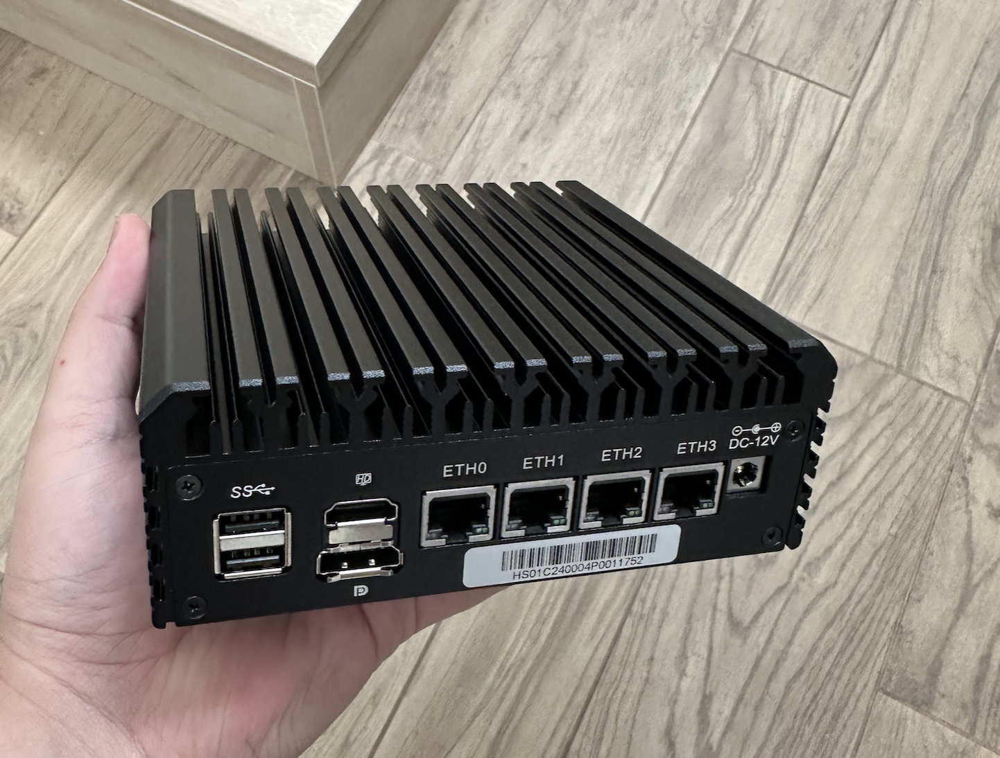
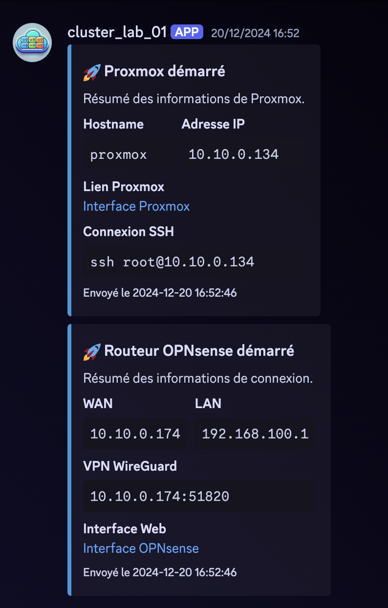

In progress ...

# Router

## Why ?

I want this lab to be completely autonomous and control the entire infrastructure. In order to do this, it is essential to have a router in front of the lab.

## Hardware
For this, I selected a sufficiently powerful equipment to virtualize an OPNSense and which has several 2.5Gbps network cards.

After some research, I found the [HUNSN Micro Firewall Appliance](https://amzn.to/4a46u9I) which is a small and powerful router with 2.5Gbps network cards.

## Installation

### Proxmox

I chose to install Proxmox to virtualize OPNSense, making it easy to backup and upgrade. This will also allow me to set up an instance with a complete monitoring solution to monitor all equipment and systems.

!!photo proxmox

### OPNsense

!!photo opensense banner

For the installation of OPNSense, it is necessary to prepare the parameters of the instance with :
- ISO image
- 2 network cards
- 100 GB of storage

Once the instance created and OPNsense installed, it is necessary to configure the LAN and WAN interfaces :

!!photo OPNsense terminal

Then we continue with the DHCP configuration :

!!photo OPNsense DHCP

The configuration of the routes and the firewall :

!!photo OPNsense firewall

### VPN

!!photo wireguard banner + logo wireguard dans techno

In order to access the infrastructure from outside, it is necessary to configure a VPN. I set up a Wireguard VPN :

!!photo OPNsense VPN

### Retrieving IP and VPN Information at Startup

This cluster needs to be autonomous and portable, so I configured the WAN address to be obtained via DHCP. However, it would be impractical to connect a screen every time it starts up just to retrieve the IP and VPN information.

The solution is to have the cluster automatically send us the IP and connection information at startup. This can be accomplished with a simple bash script:

!!script bash + logo bash dans techno

!!service

And there you have it - a few seconds after powering up the cluster, we receive the IP and connection information:

# Controller
in future ...
(Zabbix / Grafana / Loki / etc...)
