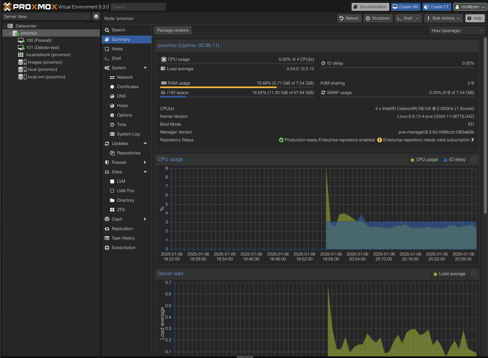
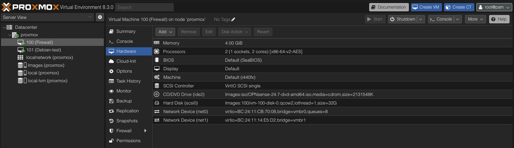
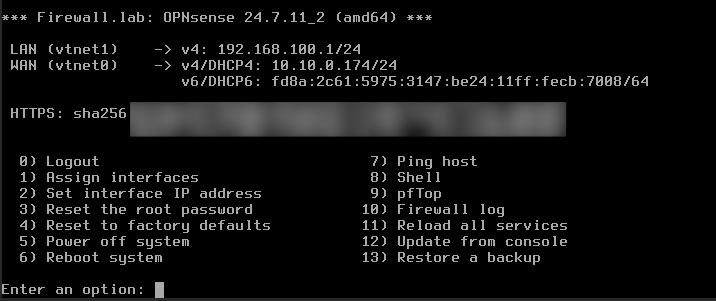
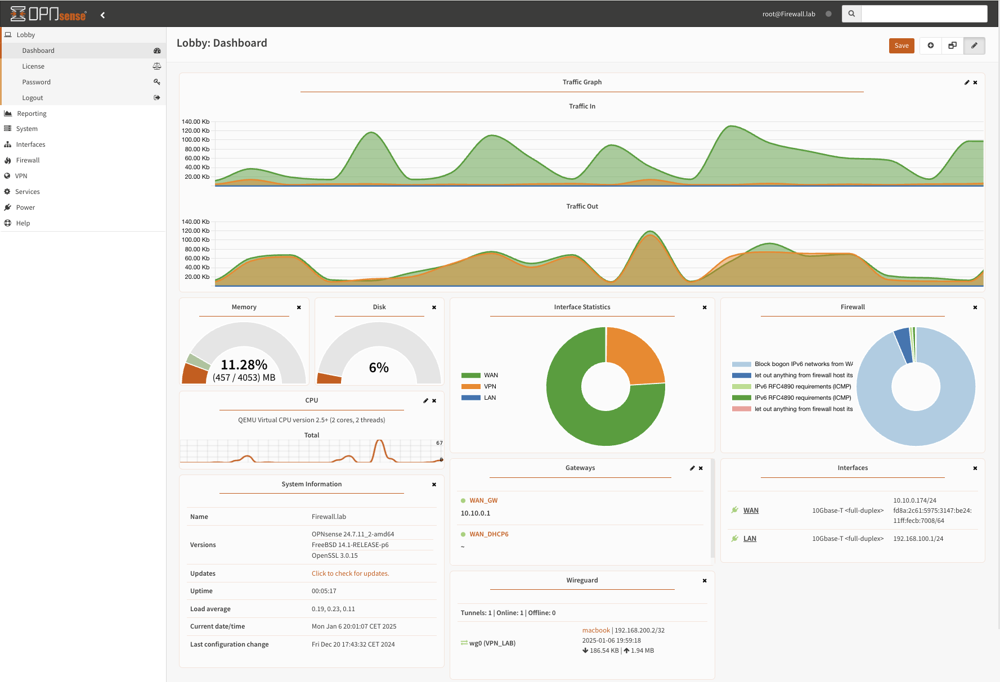
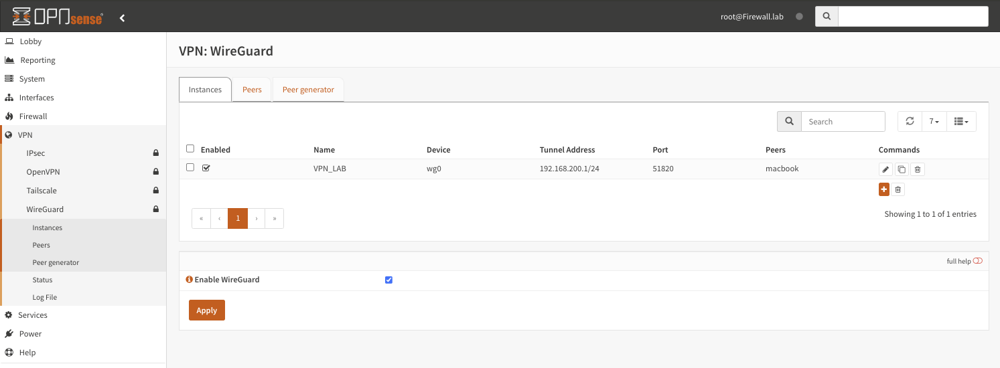

# Router

## Why ?

I want this lab to be completely autonomous and control the entire infrastructure. In order to do this, it is essential to have a router in front of the lab. Having a dedicated router provides several key benefits:

- Complete control over network segmentation and security
- Ability to implement VPN for remote access
- Traffic monitoring and bandwidth management
- Network isolation between lab environments
- Customizable firewall rules and security policies

## Hardware
For this, I selected a sufficiently powerful equipment to virtualize an OPNSense and which has several 2.5Gbps network cards.

After some research, I found the [HUNSN Micro Firewall Appliance](https://amzn.to/4a46u9I) which is a small and powerful router with 2.5Gbps network cards. This appliance offers an excellent balance of performance, power efficiency, and features:

- Intel Quad-Core processor
- Multiple 2.5GbE ports
- Low power consumption
- Compact form factor
- AES-NI support for VPN acceleration
- Sufficient RAM and storage for virtualization


## Installation

### Proxmox


I chose to install Proxmox as the hypervisor for several compelling reasons:

- Open-source solution with enterprise features
- Excellent web-based management interface
- Built-in backup and snapshot capabilities
- Live migration support
- Strong community support
- Native support for both containers (LXC) and full virtualization (KVM)
- Regular security updates and stable release cycle

This setup allows me to virtualize OPNSense, making it easy to backup and upgrade. Additionally, Proxmox's flexibility enables me to deploy a comprehensive monitoring solution alongside the router VM to oversee all equipment and systems.




### OPNsense


OPNsense was selected as the firewall/router solution for several key advantages:

- Modern, security-focused BSD-based firewall
- Regular security updates and feature releases
- User-friendly web interface
- Advanced networking features including VLANs and VPNs
- Extensive plugin ecosystem
- Active development and community support
- Built-in reporting and monitoring tools
- Enterprise-grade features without licensing costs

For the installation of OPNSense, it is necessary to prepare the parameters of the instance with :
- ISO image
- 2 network cards
- 100 GB of storage



Once the instance created and OPNsense installed, it is necessary to configure the LAN and WAN interfaces. The dual-interface setup provides proper network isolation and security:

- WAN interface: Connects to the internet/external network with DHCP
- LAN interface: Provides protected internal network for lab equipment



Then we continue with the DHCP configuration and the firewall. OPNsense provides granular control over:

- Network segmentation
- Traffic filtering
- NAT rules
- DHCP server configuration
- DNS services
- Quality of Service (QoS)

A little photo of the pretty dashboard :



### VPN


In order to access the infrastructure from outside, it is necessary to configure a VPN. I chose WireGuard for several compelling reasons:

- Modern, high-performance VPN protocol
- Simpler codebase compared to OpenVPN
- Lower overhead and better battery life
- Quick connection establishment
- Strong encryption by default
- Easy configuration and key management
- Excellent mobile client support

Here's the WireGuard dashboard showing the VPN status:



### Retrieving IP and VPN Information at Startup


This cluster needs to be completely autonomous and portable, so I configured the WAN address to be obtained via DHCP. However, it would be impractical to connect a screen every time it starts up just to retrieve the IP and VPN information.

The solution is to have the cluster automatically send us the IP and connection information at startup. This can be accomplished with a simple bash script:

```bash
#!/bin/bash

# Variables
WEBHOOK_URL="YOUR_WEBHOOK_URL"
HOSTNAME=$(hostname)
PROXMOX_IP=$(hostname -I | awk '{print $1}') # Get Proxmox IP
DATE=$(date '+%Y-%m-%d %H:%M:%S')
PROXMOX_URL="https://$PROXMOX_IP:8006"
SSH_CONNECTION="ssh root@$PROXMOX_IP"

# Function to send Proxmox notification
send_proxmox_info() {
    curl -X POST -H "Content-Type: application/json" -d "{
        \"embeds\": [{
            \"title\": \"\ud83d\ude80 Proxmox started\",
            \"description\": \"Summary of Proxmox information.\",
            \"color\": 3447003,
            \"fields\": [
                {
                    \"name\": \"Hostname\",
                    \"value\": \"\`\`\`$HOSTNAME\`\`\`\",
                    \"inline\": true
                },
                {
                    \"name\": \"IP Address\",
                    \"value\": \"\`\`\`$PROXMOX_IP\`\`\`\",
                    \"inline\": true
                },
                {
                    \"name\": \"Proxmox Link\",
                    \"value\": \"[Proxmox Interface]($PROXMOX_URL)\"
                },
                {
                    \"name\": \"SSH Connection\",
                    \"value\": \"\`\`\`$SSH_CONNECTION\`\`\`\"
                }
            ],
            \"footer\": {
                \"text\": \"Sent on $DATE\"
            }
        }]
    }" "$WEBHOOK_URL"
}

# Function to send OPNsense notification
send_opnsense_info() {
    # Wait for QEMU agent to respond
    echo "Waiting for QEMU agent information..."
    for i in {1..10}; do
        NETWORK_INFO=$(qm guest cmd 100 network-get-interfaces 2>/dev/null)
        if [[ $? -eq 0 ]]; then
            echo "QEMU agent responded."
            break
        fi
        sleep 5
    done

    if [[ -z "$NETWORK_INFO" ]]; then
        echo "Unable to retrieve OPNsense VM information."
        exit 1
    fi

    # Extract WAN, LAN, and WireGuard IPs
    WAN_IP=$(echo "$NETWORK_INFO" | jq -r '.[] | select(.name=="vtnet0") | .["ip-addresses"][] | select(."ip-address-type"=="ipv4") | .["ip-address"]')
    LAN_IP=$(echo "$NETWORK_INFO" | jq -r '.[] | select(.name=="vtnet1") | .["ip-addresses"][] | select(."ip-address-type"=="ipv4") | .["ip-address"]')
    VPN_WIREGUARD="$WAN_IP:51820"
    OPN_URL="https://$LAN_IP"

    curl -X POST -H "Content-Type: application/json" -d "{
        \"embeds\": [{
            \"title\": \"\ud83d\ude80 OPNsense Router started\",
            \"description\": \"Summary of connection information.\",
            \"color\": 3447003,
            \"fields\": [
                {
                    \"name\": \"WAN\",
                    \"value\": \"\`\`\`$WAN_IP\`\`\`\",
                    \"inline\": true
                },
                {
                    \"name\": \"LAN\",
                    \"value\": \"\`\`\`$LAN_IP\`\`\`\",
                    \"inline\": true
                },
                {
                    \"name\": \"WireGuard VPN\",
                    \"value\": \"\`\`\`$VPN_WIREGUARD\`\`\`\",
                    \"inline\": false
                },
                {
                    \"name\": \"Web Interface\",
                    \"value\": \"[OPNsense Interface]($OPN_URL)\"
                }
            ],
            \"footer\": {
                \"text\": \"Sent on $DATE\"
            }
        }]
    }" "$WEBHOOK_URL"
}

# Send notifications
send_proxmox_info
send_opnsense_info
```

And the service to launch the script at startup:
```bash
[Unit]
Description=Send Proxmox informations at startup
After=network-online.target

[Service]
Type=oneshot
ExecStart=/root/send_proxmox_info.sh

[Install]
WantedBy=multi-user.target
```

A few seconds after the cluster starts up, we receive the IP and connection information:


# Controller
in future ...
(Zabbix / Grafana / Loki / etc...)
