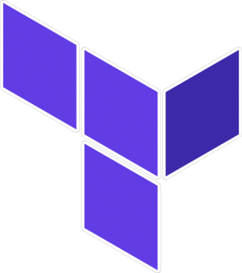
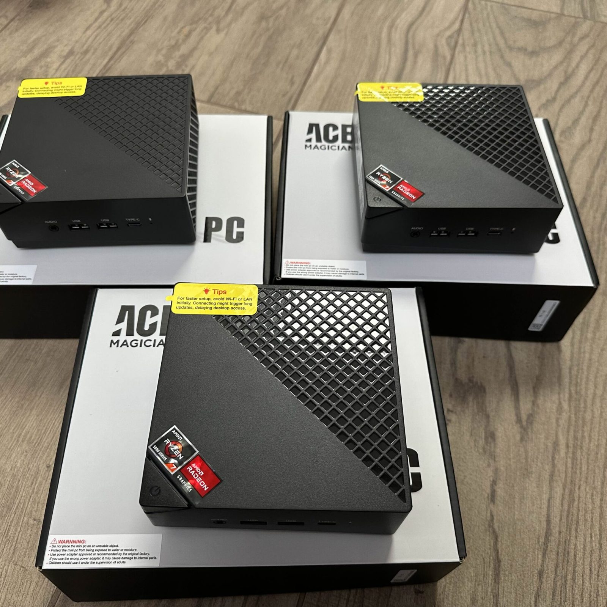

# Nutanix Lab Documentation

## Overview
Welcome to my Nutanix lab documentation. This project showcases the implementation of a three-node Nutanix cluster, designed for learning and certification preparation. Built with ACEMAGICIAN AM06PRO Mini PCs, this setup demonstrates how to create a cost-effective, energy-efficient hyperconverged infrastructure environment.

### Project Details
- **Date**: December 15, 2024
- **Author**: Mickael
- **Category**: IT Projects

### Technologies Used

    

        
        
Nutanix

    

    

        
        
Ansible

    

    

        
        
Terraform

    

    

        
        
Proxmox

    

    

        
        
Grafana

    

    

        
        
Zabbix

    

    

        
        
Git

    

    

        
        
Linux

    

    

        
        
Debian

    

    

        
        
Ubuntu

    

## Some pictures of this project

    

        

            
            
Cluster Back View

        

        

            
            
Servers

        

        

            
            
3D Print

        

    

    <button class="prev" onclick="moveSlide(-1)">&#10094;</button>
    <button class="next" onclick="moveSlide(1)">&#10095;</button>

