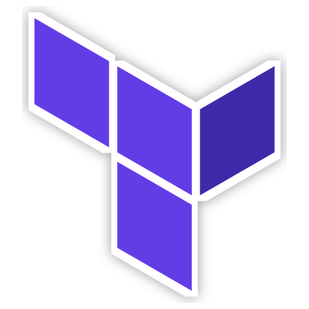
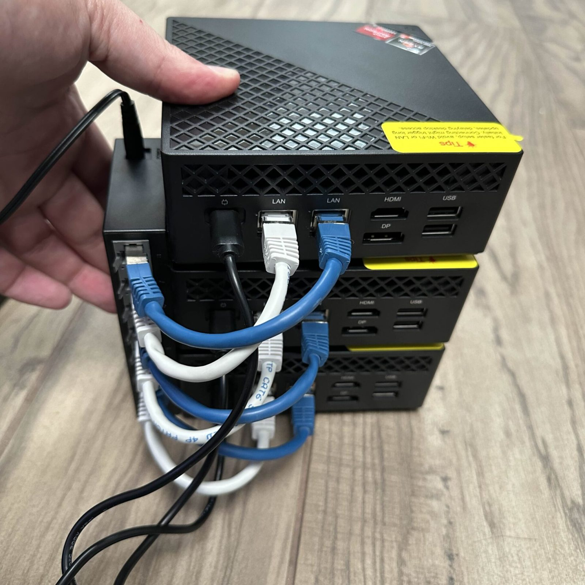

# Nutanix Lab Documentation

## Overview
Welcome to my Nutanix lab documentation. This project showcases the implementation of a three-node Nutanix cluster, designed for learning and certification preparation. Built with ACEMAGICIAN AM06PRO Mini PCs, this setup demonstrates how to create a cost-effective, energy-efficient hyperconverged infrastructure environment.

### Project Details
- **Date**: December 15, 2024
- **Author**: Mickael
- **Category**: IT Projects

### Technologies Used

    

        
        
Nutanix

    

    

        
        
Ansible

    

    

        
        
Terraform

    

    

        
        
Proxmox

    

    

        
        
Grafana

    

    

        
        
Zabbix

    

    

        
        
Git

    

    

        
        
Linux

    

    

        
        
Debian

    

    

        
        
Ubuntu

    

## Some pictures of this project

    

        

            
            
Cluster Back View

        

        

            
            
Servers

        

        

            
            
3D Print

        

    

    <button class="carousel-btn prev" style="position: absolute; left: 10px; top: 50%; transform: translateY(-50%); background: rgba(0,0,0,0.5); color: white; border: none; padding: 10px 15px; cursor: pointer; border-radius: 50%; z-index: 10; font-size: 18px;">❮</button>
    <button class="carousel-btn next" style="position: absolute; right: 10px; top: 50%; transform: translateY(-50%); background: rgba(0,0,0,0.5); color: white; border: none; padding: 10px 15px; cursor: pointer; border-radius: 50%; z-index: 10; font-size: 18px;">❯</button>

    

        
        
        
    

    

